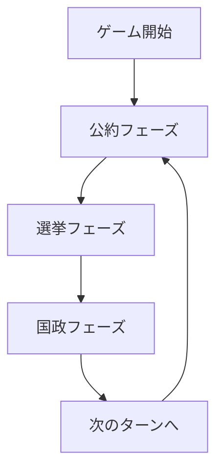
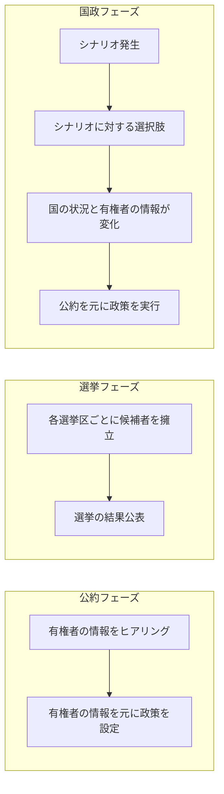

# ゲームの概要

## フロー

全体フロー

```mermaid
flowchart TD
    A[ゲーム開始] --> B[公約フェーズ]
    B --> C[選挙フェーズ]
    C --> D[国政フェーズ]
    D --> E[次のターンへ]
    E --> B[公約フェーズ]
```

各フェーズの内容

```mermaid
flowchart LR
    subgraph 公約フェーズ
        B1[有権者の情報をヒアリング]
        B2[有権者の情報を元に政策を設定]
        B1 --> B2
    end

    subgraph 選挙フェーズ
        C1[各選挙区ごとに候補者を擁立]
        C2[選挙の結果公表]
        C1 --> C2
    end

    subgraph 国政フェーズ
        D1[公約を元に政策を実行]
        D2[シナリオ発生]
        D2 --> D3[シナリオに対する選択肢]
        D3 --> D4[国の状況と有権者の情報が変化]
        D4 --> D1
    end
```
## モデル

表示対象

国
- 5つの指標を可視化
- 人口構造・教育レベルの可視化

政党
- 財政情報
- 政策情報
- スキル情報

政治家
- スキル情報

```mermaid
erDiagram
    Party {
        int id PK "政党ID"
        string name "政党名"
        int fund "資金"
    }
    PartyStrategy {
        int id PK "政党施策ID"
        int partyId FK "所属政党ID"
        int economy "経済度"
        int health "健康度"
        int environment "環境度"
        int safety "安全度"
        int society "社会度"
    }
    District {
        int id PK "選挙区ID"
        int nationId FK "所属国ID"
        string name "選挙区名"
    }
    DistrictPopulationStructure {
        int id PK "人口構造ID"
        int districtId FK "所属選挙区ID"
        string ageGroup "年齢層"
        string gender "性別"
        int population "人口"
        int educationalLevel "教育レベル"
    }
    DistrictPopulationSupportRates {
        int id PK "支持率ID"
        int districtPopulationStructure FK "所属人口構造ID"
        int partyId FK "政党ID"
        int supportRate "支持率"
    }
    Politician {
        int id PK "政治家ID"
        int partyId FK "所属政党"
        int districtId FK "所属選挙区"
        string name "政治家名"
        int age "年齢"
        string gender "性別"
        boolean isCurrent "現役議員"
        boolean isMinister "現役大臣"
    }
    PoliticianSkill {
        int id PK "政治スキル"
        int politicianId FK "政治家ID"
        int strategy "戦略スキル"
        int rhetoric "弁論スキル"
        int action "実行スキル"
    }
    Nation {
        int id PK "国ID"
        string name "国の名前"
    }
    NationStatus {
        int id PK "国状況ID"
        int nationId FK "所属国ID"
        int economy "経済度"
        int health "健康度"
        int environment "環境度"
        int safety "安全度"
        int society "社会度"
    }

```

